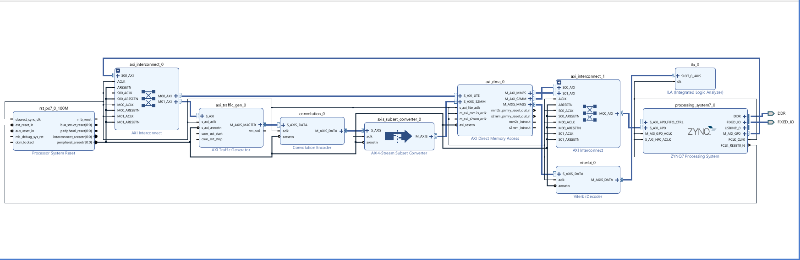

# Hardware/Software Co-Design Projects

Two coursework projects developed for the **Hardware/Software Co-design with AI Integration** course using the AMD/Xilinx flow on the **PYNQ-Z2** board.

## Projects

### 1. Image Processing System

The FPGA generates a 64 × 64 RGB color-bar image and AXI VDMA stores it in DDR memory. The ARM software reads the pixels, converts them to grayscale and stores the result in memory.

[View the image-processing project](image-processing-system/)

### 2. Wireless Communication System

The FPGA generates and convolutionally encodes a data stream. AXI DMA stores the encoded data in DDR, where the ARM software adds simulated channel noise and creates soft-decision samples. DMA sends the samples to the Viterbi Decoder, and the decoded output is observed using the ILA.

[View the wireless communication project](wireless-communication-system/)

## Repository structure

Each project contains:

- `images/`: the Vivado block-design screenshot.
- `hardware/`: the Vivado block-design source.
- `software/main.c`: the bare-metal Vitis application.

