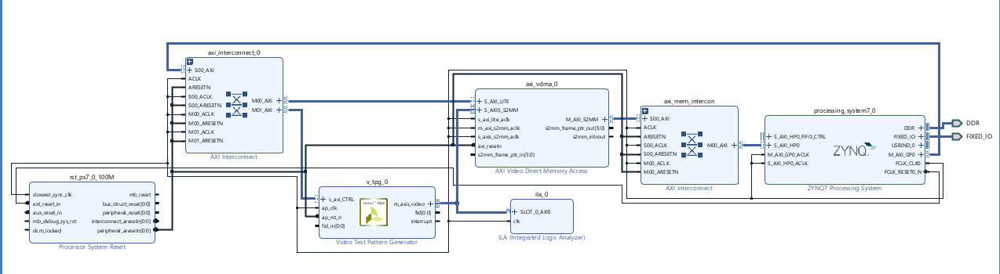

# Image Processing System

This project implements a basic hardware/software image-processing pipeline on the PYNQ-Z2.

## Architecture

1. The Video Test Pattern Generator produces a 64 × 64 RGB color-bar frame.
2. AXI VDMA receives the AXI4-Stream pixels and writes the frame to DDR through the Zynq high-performance port.
3. Software running on the ARM processor reads the frame and calculates an 8-bit grayscale value for every pixel.
4. An ILA monitors the video stream during hardware debugging.

## Hardware interfaces

- TPG output: AXI4-Stream video, 24-bit RGB pixels.
- VDMA direction used: S2MM (stream to memory).
- Processor control: AXI4-Lite through the PS general-purpose master port.
- Frame memory: DDR through a PS high-performance slave port.

## Implementation result

| Metric | Result |
|---|---:|
| Target | PYNQ-Z2 (`xc7z020clg400-1`) |
| Vivado version | 2022.2 |
| WNS | 2.083 ns |
| WHS | 0.019 ns |
| LUTs | 5,043 (9.48%) |
| Flip-flops | 7,044 (6.62%) |
| BRAM tiles | 4 |
| DSPs | 0 |
| Bitstream | Generated successfully |

## Software

`software/main.c` is a corrected Vitis 2022.2 standalone application for the archived hardware configuration. It:

- provides all three frame-buffer addresses required by the configured VDMA;
- starts the VDMA before the TPG;
- captures one frame using a frame counter and timeout;
- checks driver return values and VDMA errors;
- performs cache maintenance at the DMA ownership boundaries; and
- writes all 4,096 grayscale pixels to `GrayFrame` and prints their range and checksum.

The normal standalone linker script must place the global buffers in PS DDR, as it does in the supplied Vitis platform.

## Contents

- `hardware/c2g.bd`: Vivado block-design source.
- `software/main.c`: corrected bare-metal Vitis application.
- `docs/implementation-summary.md`: implementation and reproducibility notes.
