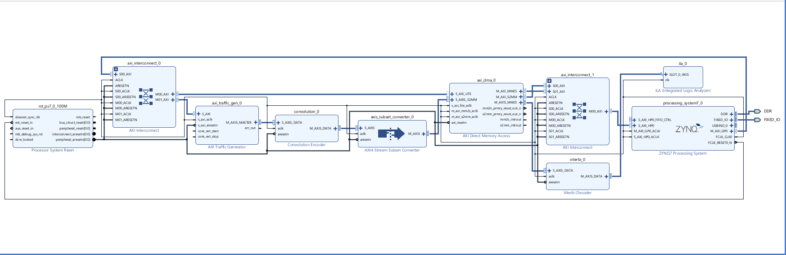

# Wireless Communication System

This project demonstrates a simple digital communication chain implemented as a hardware/software co-design on the PYNQ-Z2 board.

## What the project does

1. The AXI Traffic Generator creates the source data.
2. The Convolutional Encoder adds redundancy so the data can be recovered after transmission errors.
3. AXI DMA transfers the encoded data to DDR memory.
4. The ARM processor adds simulated channel noise and prepares the data for decoding.
5. AXI DMA sends the noisy data back to the programmable logic.
6. The Viterbi Decoder recovers the original data.
7. The ILA displays the decoder output for hardware observation.

## Main components

| Component | Purpose |
|---|---|
| Zynq-7000 Processing System | Runs the software and controls data stored in DDR memory. |
| AXI Traffic Generator | Produces the input data stream. |
| Convolutional Encoder | Protects the data by adding redundant coded bits. |
| AXI4-Stream Subset Converter | Adds the packet boundary required by the DMA. |
| AXI DMA | Moves data between the hardware stream and DDR memory. |
| Viterbi Decoder | Reconstructs the original data from the noisy coded data. |
| ILA | Captures the decoded output inside the FPGA. |

## Project purpose

The project shows how the ARM processor and FPGA logic can work together in one SoC. The FPGA handles the communication blocks, while the processor handles the software channel model and controls the memory transfers.
